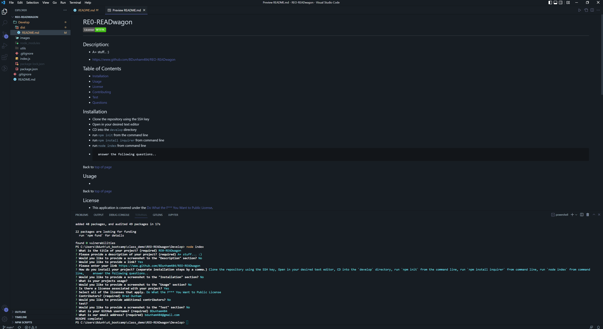
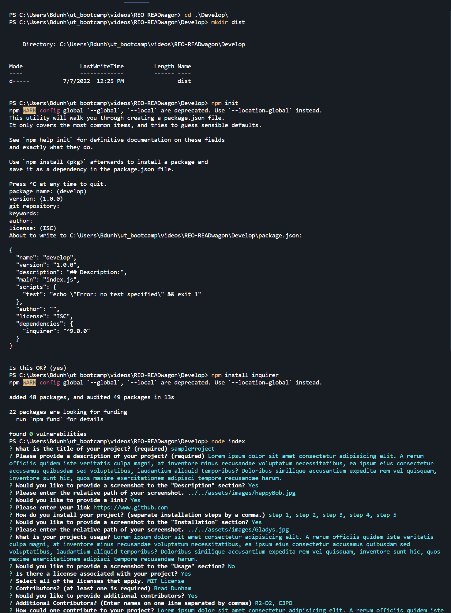

# REO-READwagon  

## Description: 

* A CLI that produces great looking `README.md` files based off user input about your project.

* <a href='https://www.github.com/BDunham484/REO-READwagon'>https://www.github.com/BDunham484/REO-READwagon</a>
* <a href='https://drive.google.com/file/d/1I90GVS0_Xx6HytdTDw2nPuL8fS6Pw7bM/preview'>Demonstration Video</a>

## Table of Contents

- [Installation](#installation)
- [Usage](#usage)
- [License](#license)
- [Contributing](#contributing)
- [Test](#test)
- [Questions](#questions)

## Installation

* Clone the repository
*  Open in your desired text editor
*  CD into the `Develop` directory
*  Make a dist directory with `mkdir dist`
*  Run `npm init` from the command line
*  Run `npm install inquirer` from the command line

Back to [top of page](# )

## Usage

* Run `node index.js` from the command line to initiate a series of questions. Your responses are then used to populate your new `README.md` file. Upon completion, the file will be saved in the `dist` folder. Fun Fact: The `README.md` file you're currently reading was generated using `REO-READwagon`!

Back to [top of page](# )

## License

* This application is covered under the <a href='http://www.wtfpl.net/about/'>Do What the F*** You Want to Public License</a>.

Back to [top of page](# )

## Code Contributors

#### Made with ❤️ by:

* Brad Dunham

Back to [top of page](# )

## Contributing

If you have anything you'd like to contribute, feel free to submit an issue!

## Test

* No TDD at the moment...

Back to [top of page](# )

## Questions?

* If you have any questions you can find me here: <https://www.github.com/BDunham484>
* You can also reach me here: bdunham484@gmail.com

Back to [top of page](# )

    
